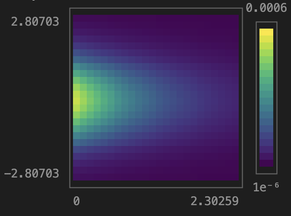

# Griddle.jl

[](https://github.com/markmbaum/Griddle.jl/actions/workflows/CI.yml?query=branch%3Amain)

A small module for small Bayesian models.

This package performs Bayesian grid approximation. It computes joint probabilities at discrete parameter values in low-dimensional posterior distributions. It does this by
1. Computing the prior probability density for each parameter over a range of discrete, evenly spaced values.
2. Evaluating the likelihood at all combinations of the discrete parameter values. For example, if the model has two parameters, the discrete posterior approximation is a two-dimensional grid.
3. Directly evaluating Bayes' rule by multiplying prior densities with likelihoods at the sample points (summing log-likelihoods and log-priors).
4. Normalizing the whole grid of posterior densities, such that it represents probability mass at each grid point.

This method is only computationally feasible for small and low-dimensional models. It's a pedagogical toy more than anything, and you should use [Turing.jl](https://turing.ml/) for practical modeling projects. But it could be useful as a minimal modeling tool.

You can install using the repository link
```julia
using Pkg
Pkg.add("https://github.com/markmbaum/Griddle.jl")
```

## Usage

There are only two main functions

1. `gridapproximation(loglikelihood; params...)`

    This function takes your log-likelihood function and your priors and returns a grid of posterior probability masses as an AxisArray. The likelihood must map parameters to log probability density and enclose your data. Priors are given as keyword arguments in the same order the likelihood expects them. It's easiest to look at examples, which are below.

2. `sampleposterior(post::AxisArray, N::Int=10_000)`

    This function takes your grid of posterior probability masses (from `gridapproximation`), samples parameter combinations randomly according to their mass, and returns the sampled combinations in a dictionary of vectors. This is like mock MCMC. The dictionary is easily converted to a DataFrame.

### Coin flipping example

We're estimating the probability of getting heads when flipping a biased coin. The parameter to estimate is `p`, the chance of getting heads on an individual flip. We flip the coin ten times and get two heads. To estimate `p` using `gridapproximation`:
```julia
using Griddle, UnicodePlots

post = gridapproximation(
    #likelihood definition
    p -> logpdf(Binomial(10, p), 2),
    #prior definition
    p = Uniform(0,1)
)
```
The `post` variable is an AxisArray with a single dimension for `p`. We can look at the posterior probability masses.
```julia
lineplot(post.axes[1].val, post)
```


The posterior probability mass starts piling up around 0.2, as expected. By default, each parameter (just `p` in this case) is evaluated at 101 discrete values. We can choose how many grid samples we want for each parameter by passing them as a NamedTuple. For example
```julia
post = gridapproximation(
    #likelihood
    p -> logpdf(Binomial(10, p), 2),
    #prior
    p = (
        prior=Uniform(0,1),
        n=1000
    )
)
```
That will compute the same thing with ten times as many samples.

If we want to sample of `p` values, we do
```julia
samp = sampleposterior(post)

histogram(samp[:p])
```


### Linear Regression Example

A super basic linear regression. We have eleven points, a single feature, and no intercept. We're estimating the slope (β) and the variance (σ).
```julia
using Griddle, UnicodePlots, LinearAlgebra

x = 0:0.2:1
β = 0.5
σ = 0.2
y = β*x .+ σ*randn(length(x))

post = gridapproximation(
    #likelihood
    (β,σ) -> logpdf.(Normal.(β*x, σ), y) |> sum,
    #priors
    β = (
        prior=Normal(0,1),
        n=1000,
        q=0.9
    ),
    σ = Exponential(1)
)
```
Notice a few things
* The data, our `x` and `y` vectors, are enclosed by the likelihood function
* We have to *sum* the log likelihoods over each data point
* The posterior grid will now have two dimensions because there are two parameters
* We restricted the grid samples for β to the middle 90 % of its prior probability mass and asked for 1000 samples in that interval
```julia
lineplot(post.axes[1].val, normalize(sum(post, dims=2)[:,1], 1))
```


The posterior probability is nicely packed around 0.5, just as expected. And if we sample and plot the `σ` parameter:
```julia
histogram(sampleposterior(post)[:σ])
```


It also collapses toward 0.2, as expected.

We can also get a DataFrame of samples, which might be easier to work with.
```julia
using DataFrames

sampleposterior(post) |> DataFrame
```
```
10000×2 DataFrame
   Row │ β           σ
       │ Float64     Float64
───────┼──────────────────────
     1 │ 0.0320709   0.317899
     2 │ 0.522114    0.264916
     3 │ 0.373305    0.211933
     4 │ 0.519548    0.370882
     5 │ 0.175748    0.370882
     6 │ 0.183445    0.211933
     7 │ 0.383567    0.15895
     8 │ 0.609346    0.370882
     9 │ 0.227062    0.264916
    10 │ 0.668357    0.211933
```

### Prior Predictive Simulation

To approximate the joint prior density, just use the same `gridapproximation` function without a log-likelihood function. Pass the parameters only. For example
```julia
post = gridapproximation(
    μ = (
        prior=Normal(),
        q=0.995
    ),
    σ = (
        prior=Exponential(),
        q=0.8
    )
)

x, y = post.axes[2].val, post.axes[1].val

heatmap(
    post,
    xfact=diff(x)[1],
    yfact=diff(y)[1],
    xoffset=0,
    yoffset=minimum(y) - mean(y)
)
```
